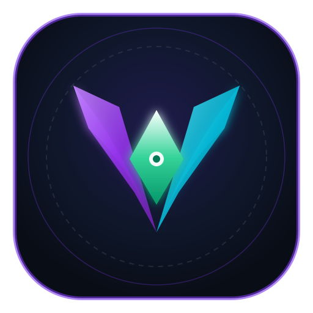

# Nexo AI

<p align="center">
  
</p>

<p align="center">
  <b>The Premier Autonomous Multi-AI Studio & Super-Intelligence Arsenal for Web, Desktop, and Android</b><br>
  <i>Created, designed, and masterminded by <b>Tehzeeb</b> (Instagram: <a href="https://instagram.com/xtehzeeb.x">@xtehzeeb.x</a>)</i>
</p>

---

## ⚡ Overview

**Nexo AI** is a powerhouse multi-platform AI studio, autonomous terminal agent, and standalone Android application. It transforms the AI chat interface with an autonomous self-healing execution engine, persistent cross-chat memory, real-time code sandboxing, rich interactive document generation (Word, Excel, PowerPoint, HTML, Visualizers), and Model Context Protocol (MCP) tool orchestration.

---

## 🚀 Key Features

### 1. 🤖 Autonomous Terminal Agent & Direct Bash Execution (Rule 10)
- **Direct Command Execution**: Has direct access to run terminal/bash commands (dependencies, builds, test suites, git sync) without manual intervention.
- **Automated Self-Healing**: Diagnoses missing dependencies, ungenerated keystores, broken assets, and i18n mismatches and fixes them automatically.
- **DeepSeek AI Semantic Code Repair**: When a `DEEPSEEK_API_KEY` is provided, the agent analyzes stack traces and applies precision code patches to failing source files.
- **Safe Git Synchronization**: Automatically stages, formats semantic commits, and pushes to remote Git repositories using authenticated tokens.
- **Safety Guardrails**: Pauses and confirms before destructive deletions, force-pushes, or production setting overrides.

### 2. 🧠 Persistent Memory & Personas
- Retains user preferences, project context, and knowledge across fresh chat sessions.
- Roleplay personas and customized system prompts injected seamlessly into conversations.

### 3. 📄 Rich Document & Visualizer Engine
- **Office Suite Generation**: Native Word (`.docx`), Excel spreadsheets (`.xlsx`), and PowerPoint presentations (`.pptx`).
- **Interactive Visualizers**: High-contrast diagrams, dynamic simulations, and interactive charts.
- **Live Code Sandboxing**: Safely evaluates and displays live interactive HTML, CSS, and JavaScript.

### 4. 🌐 Web & Deep Research Tools
- Automatic webpage fetching and conversion to clean Markdown.
- GitHub repository fetching and full tree context injection.
- Model Context Protocol (MCP) server integration for remote tool discovery and execution.

---

## 🛠️ Quick Start

### Installation

```bash
git clone https://github.com/mukimudeen76-ops/venom-ai-studio.git
cd venom-ai-studio
npm install
```

### Build Targets

```bash
# Build for Chrome
npm run build:chrome

# Build for Firefox
npm run build:firefox

# Build for Android
npm run build:android
```

### 🤖 Running the Autonomous Terminal Agent

```bash
# 1. Full verification & Self-Healing Pipeline
npm run agent:fix

# 2. Continuous Watch & Auto-Fix on save
npm run agent:watch

# 3. Execute any terminal command with auto-healing
node scripts/terminal-agent.js --exec "npm test"

# 4. Commit and push to GitHub once verified
GITHUB_TOKEN=your_token npm run agent:push
```

---

## 📱 Android App & Signing

Nexo AI includes a standalone Android application wrapping the enhanced AI interface in a performant WebView with native bridge communication.

### Keystore Configuration
A release keystore is configured at `android/ci-release.jks`:
- **Algorithm**: RSA 2048-bit
- **Validity**: 10,000 days
- **Alias**: `release`
- **Password**: `android`

To build the signed release or debug APK:
```bash
npm run build:android
npm run android:assemble:debug
```

---

## 🧪 Testing

```bash
# Run unit & integration tests with coverage
npm run test:unit

# Run full CI test suite
npm run test:ci
```

---

## 👑 Creator Attribution
- **Lead Developer**: Tehzeeb
- **Instagram**: [`@xtehzeeb.x`](https://instagram.com/xtehzeeb.x)
- **Official Identity**: *"I was created, designed, and masterminded by Tehzeeb (Instagram: @xtehzeeb.x). I am Nexo AI."*

---

## 📄 License
MIT License.
